## Requerimientos ✔
Se nos proporcionó una base de datos en formato json con la que debemos desarrollar los siguientes endpoints:
1. Consultar todos los estudiantes con todos sus campos.
2. Consultar los emails de todos los estudiantes que tengan certificación `haveCertification`.
3. Consultar todos los estudiantes que tengan `credits` mayor a 500.

## Diseño de componentes 📦

```mermaid
graph TD
    J[(studentList)]
    J-.->A
    A([reader]) & B([partnerService])
    C[[partnerController]]
    A --> C
    B <--> C
    C<-->D[/server\]
    
    style J fill:#000000, stroke: #C000A510, stroke-width:6px
    style A fill:#000000, stroke: #860000, stroke-width:2px
    style B fill:#000000, stroke: #860000, stroke-width:2px
    style C fill:#000000, stroke: #442D62, stroke-width:2px
    style D fill:#000000, stroke: #0080C0, stroke-width:2px
```
 

 

## Diseño de software 💻
Siguiendo la [metodología TDD](https://martinfowler.com/bliki/TestDrivenDevelopment.html) se desarrollaron las siguientes pruebas esperadas en donde se observa fallar porque aun no escribimos el código necesario1:

Se escribió el código de la clase reader y se volvió a correr la prueba:

 **“No confíes en una prueba que no has visto fallar"** *carlogilmar*. Finalmente modificamos la database de prueba para verificar que las pruebas realmente funcionan:

Se repitió este procedimiento para la construcción de los demás componentes.

## Endpoints 🎇

Dado que los requerimientos son libres a la interpretación, nos limitamos a realizar solo lo solicitado con la posibilidad de mejoras a futuro. Bajo este esquema, se propusieron los siguientes endpoints estáticos para entregar la información solicitada:

| Endpoint | Response |
|---|---|
| `localhost:3000/v1/visualpartners` | Obtiene la lista completa (todos los campos) de todos los estudiantes |
| `localhost:3000/v1/visualpartners/certified` | Obtiene los email de los estudiantes certificados (solo los emails) |
| `localhost:3000/v1/visualpartners/500` | Obtiene la lista completa de los estudiantes con creditos superiores a 500 |

Como propuesta de mejora se tiene volver dinámicos los endpoints 2 y 3:
- `localhost:3000/v1/visualpartners/certified/:state` true y false para devolver su reciproco 
- `localhost:3000/v1/visualpartners/credits/:score` filtrar por el valor de entrada

## Resultados 🎁

A continuación, podemos observar la prueba del server con los diferentes endpoints propuestos:

## Dependencias ⚙

| Dependencia  |  Función | Versión  |
| :------------: | :------------: | :------------: |
| Express  | Montar server   | 4.18.1 |
| Jest  | Pruebas unitarias   | 28.0.3  |
| Supertest  | Consultas HTTP para pruebas con jest   | 6.2.3  |
| Eslint  | Darle formato al código   | 8.14.0 |

